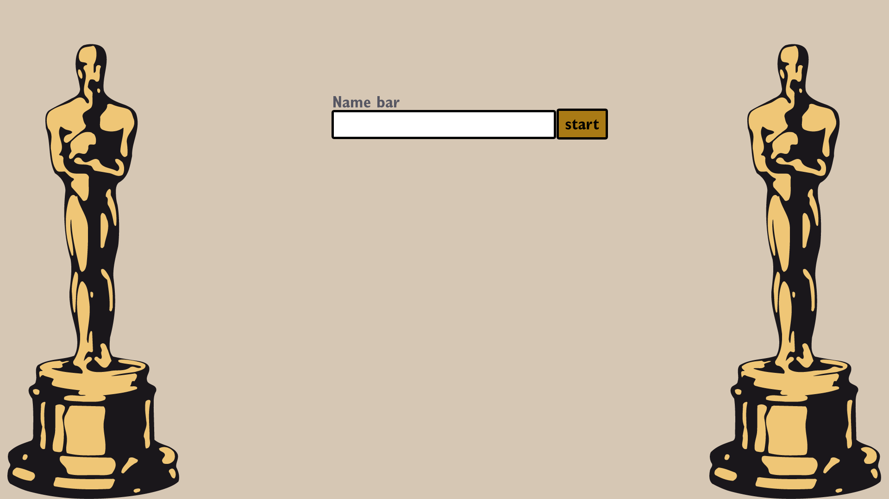
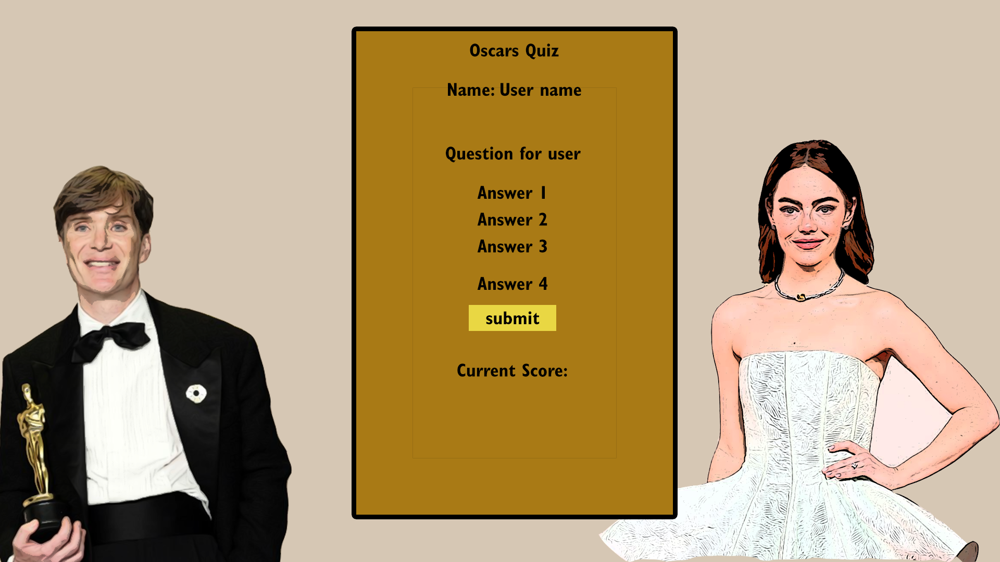
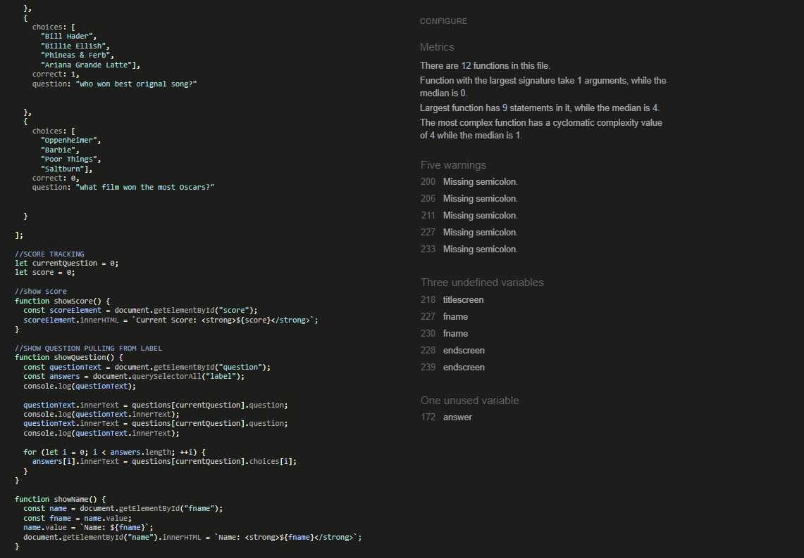
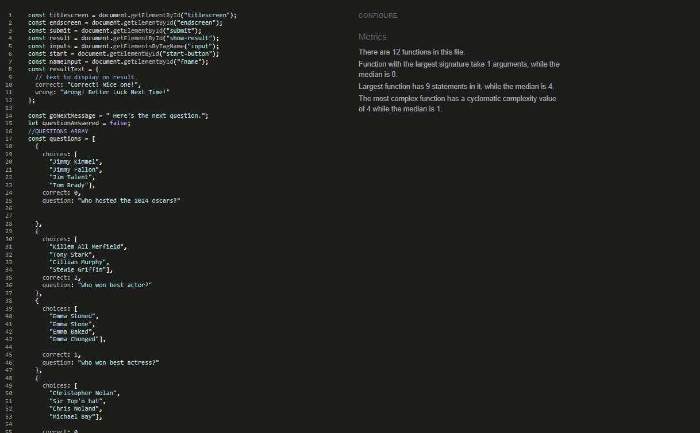
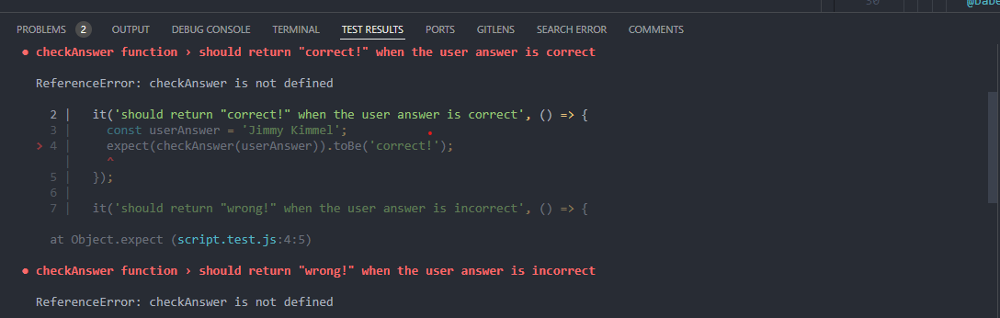
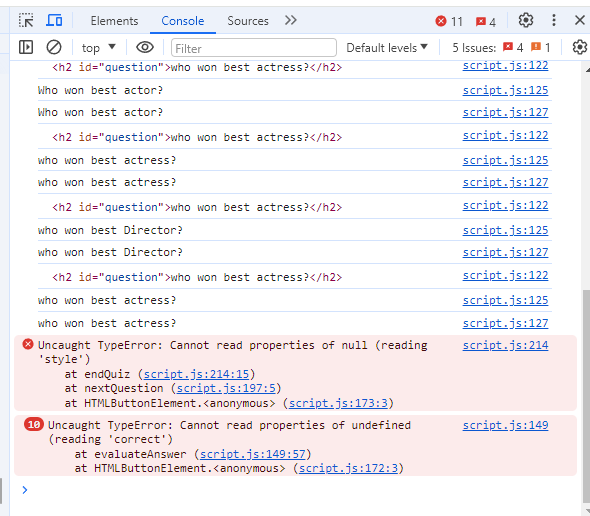
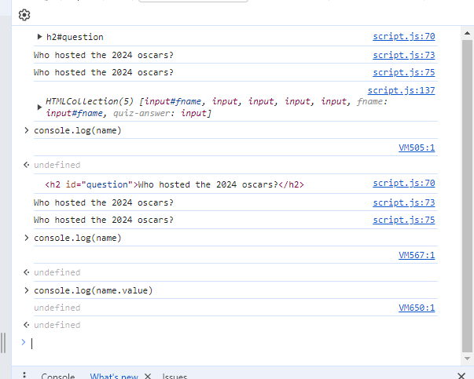

# Oscars Quiz
The Oscars quiz is a 10 question quiz testing the users knowledge on The Oscars, it includes a page to enter your name and, multiple choice questions and an ending page rounding up the total score and having the option to try again. The purpose of this quiz is to mainly test the users knowledge on the 2024 Oscars.

# User Stories
The purpose of the Oscars app is to test the users knowledge, it has an enter name input to make it more personal and user friendly also having the option to try again at the end of the quiz 

### Project goals 

* Test the users knowledge on the 2024 Oscars
* Make a bright fun quiz
* Make the quiz personalized with custom messages
* Make a fully functioning 10 question quiz

# UX Design

The site is a simple design with the quiz card in the middle with all the information on there, then in the background I've photoshopped some actors into the background. 

To achieve the websites objectives to navigate through the different pages of the website I have added different sections in the html file instead of different pages though this may change the language mainly used for this project is javascript jquery the html file is very sparse because the logic i've used is that the javascript renders what is put into the html file using JQuery

The information will be displayed on the dark background elements to make it stand out from the main background image of the website.
The main design for the website will have the font color in #fff (white) and background elements in rgba(26, 24, 21, 0.733) (Dark black) to make the text stand out and be visually appealing the main body of the page will feature an image taken by the photographer to make it more streamlined for the companies purpose. The main font will be "poppins" because that is a common and nice font family. For the mobile design all content will be centered so it is an easy scrollable experience for the user and the desktop page will be more spaced out between elements so the seperate content can breathe a little. 

 # WireFrames Desktop
   
    Here is the wireframe for the main index page, it is a bit different from the final result as the website wasn't mobile friendly at the start so I modified it to make it more mobile friendly. 

   
    The Gallery wireframe.

  

# Wireframes Mobile

# Features 

1. Navigation bar at the top of the webpage, to navigate around the seperate pages on the website.
   
2. permanent footer at the bottom of the page to display the copyright and social media links that open up with seperate tabs using the target \_blank attribute.
   
3. A contact form to get in touch with the company including name, email and message with the form set to required so the user can't send blank messages name or invalid email address. The original structure of the form was borrowed from chat.gpt but the whole styling got changed due to aesthetic not fitting with the webpage. Responsive on different devices, Achieved by media queries.
   
4. A gallery so the user can look at the recent images that the company has produced and encourages the user to have more incentive to get in touch with the company. The gallery is fully responsive on all devices.
   

## Future features
 For the future features I would like to add a shop page to the website where the user can click on the image and buy the image from the website and for it to be printed onto a canvas.

# Technologies Used 
* Google Fonts
* Adobe PhotoShop
* HTML 
* CSS
* VSCode
* Code Anywhere 
* Blackbox AI
* Github.com
* Git
* Font Awesome
* Am I Reponsive
* Jquery
* Javascript

# Manual testing 

| First Header  | Second Header | Third Header |
| ------------- | ------------- | ------------ |
| Content Cell  | Content Cell  |              |
| Content Cell  | Content Cell  |              |

### Navigation Bar
To manual test the navigation bar links you will need to click on the navigation bar links and see if they take you to the right page.
* Gallery should take you to the "gallery page" where you will see the gallery and equipment list.
* Packages should take you to the "packages page" where you will see the different packages on offer for the website.
* Contact should take you to the "contact page" where you will see the contact form and contact numbers and address for the company.
* To get back to the main page you will need to click on "Winterburn Photography" in the header and that should take you back to the main page. 
* They should work on each indvidual page you click on.

### Footer links 
To manual test the footer links, you should click on the footer logos.
* The Facebook logo should take you to Facebook.
* The Instagram logo should take you to Instagram.
* The YouTube logo should take you to YouTube.

These should work for all different pages e.g. if they work on the main page they should work for the Gallery page etc.

Note that these will just take you to the landing page as there is no actual social media sites for Winterburn Photography.

### Contact Form
To manual test the contact form you will need to. 
* Go to "contact" on the navigation bar
* Fill out the form with everything filled in including a valid "@" email.
* If done correctly the form should take you to this page. 

 * Try send a message without a name if it comes up with "Please fill out this field" then the form is working as it should.
  * Try send a message without an email if it comes up with "Please fill out this field" then the form is working as it should.
  * Try send a message without a message if it comes up with "Please fill out this field" then the form is working as it should.

## W3C Validation 
Managed to fix these few errors by finding the lines of code referenced on the page and removing the stray tags and correctly formating the code. Here are the results. 

Here are the validation images for the HTML 
 

### JSHint

### Am I Responsive 

### Lighthouse Report 

Lighthouse report looks good on this.

# Challenges and Bugs
The only bugs I got were unclosed elements and stray tags. Some titles weren't formatted correctly which you can see here.
At first the webpage was not valid as seen by this screenshot here 

I ran into another problem again on my Github, I had made a previous account called "Twinwinter" on my email address robertwinterburn@hotmail.co.uk and I had made a new account to make my name a bit more professional and readable (RWinterburn) but when I started making commits they came from "Twinwinter" on one and "RWinterburn" from another I don't know wether it was to do with me from switching from gitpod.io and codeanywhere to VScode need to figure this problem out for future developments as I haven't figured it out yet. So you will see commits from both of my Github accounts.

# Deployment and Development 

### Deployment 

To deploy the website the user must 
* Log in to Github.com.
* Go to "settings".
* Click "pages" under "codes and automation".
* Select "deploy from a branch" and select the "main" branch.
* Then select "/(root)" 
* Click "save" to save the Github page source.
* Go to "code".
* Click on the yellow circle on the page repository.
* You will see the backend working on building the website when this is complete go to "settings"
* Click "pages" 
* You should see the website link https://rwinterburn.github.io/PP1/
* Click on the link and you will see the website.

### Development 
For future development go to https://github.com/RWinterburn/PP1
* Click the green "code" button.
* Copy the URL
* Go to your cloud based coding site. e.g. Code Anywhere or Gitpod.io
* click on "new workspace". 
* Paste in the repository URL
* Click create and it will create the code space for you.

#### VSCode Development
For future development go to https://github.com/RWinterburn/PP1
* Click the green "code" button.
* Copy the URL
* Open "command palette in VSCode (CTRL + SHIFT + P)
* Click the option "Git Clone"
* Click "clone from Github"
* Paste in the Repository URL 
* Hit "Enter"
* A window will pop up on your computer asking you to choose you repository destination, choose an appropriate folder. 
* Select the repository destination and the workspace will click open. 
* You may get the option saying "Do you trust this author? click Yes"

# Tutorials Used

## Image Credits
Oscars picture: https://in.pinterest.com/pin/academy-awards-png-academy-awards-artwork-award-clip-art-download--803048177290626601/
Cillian Murphy original picture: https://www.bbc.co.uk/news/entertainment-arts-68531669
Emma Watson orignal picture: https://people.com/oscars-2024-emma-stone-red-carpet-photos-8604131

## To Do list

edit read me designed for the project 2,
make the quiz responsive with media queries 
make the quiz look better 
maybe make the quiz h1 element bigger?

