# Oscars Quiz
The Oscars quiz is a 10 question quiz testing the users knowledge on The Oscars, it includes a page to enter your name and, multiple choice questions and an ending page rounding up the total score and having the option to try again. The purpose of this quiz is to mainly test the users knowledge on the 2024 Oscars.

# User Stories
The purpose of the Oscars app is to test the users knowledge, it has an enter name input to make it more personal and user friendly also having the option to try again at the end of the quiz 

### User Goals
* To learn more about the Oscars
* To test their knowledge on the Oscars
* To have fun and enjoy the quiz
* To have the option to try again if they don't get the top score
* To have the option to enter their name to make it more personal and user friendly

### Site Owner goals 

* Test the users knowledge on the 2024 Oscars
* Make a bright fun quiz
* Make the quiz personalized with custom messages
* Make a fully functioning 10 question quiz

# UX Design

The site is a simple design with the quiz card in the middle with all the information on there, then in the background I've photoshopped some actors into the background.

To achieve the websites objectives to navigate through the different pages of the website I have added different sections in the html file instead of different pages though this may change the language mainly used for this project is javascript jquery the html file is very sparse because the logic i've used is that the javascript renders what is put into the html file using JQuery

The main design for the website will have the font color in black and background elements in will be golden to match the theme of the oscars (Dark black) to make the text stand out and be visually appealing the main body of the page will feature images on the background of actors to make it more streamlined for the applications purpose. 

 # WireFrames Desktop

 For the wireframes I didn't have a wireframe designer so I designed the app on Adobe Photoshop.

 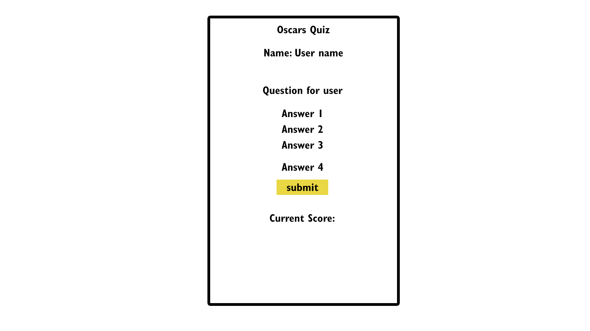
 Early Wireframe 
   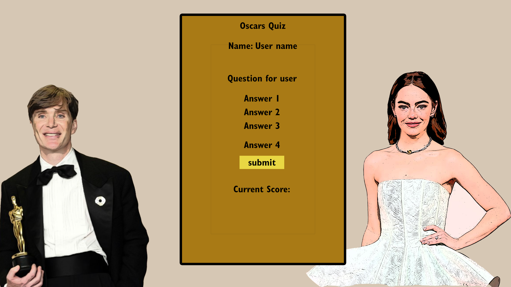
    Here is the wireframe for the main index page, it is a bit different from the final result as the website wasn't mobile friendly at the start so I modified it to make it more mobile friendly. 

   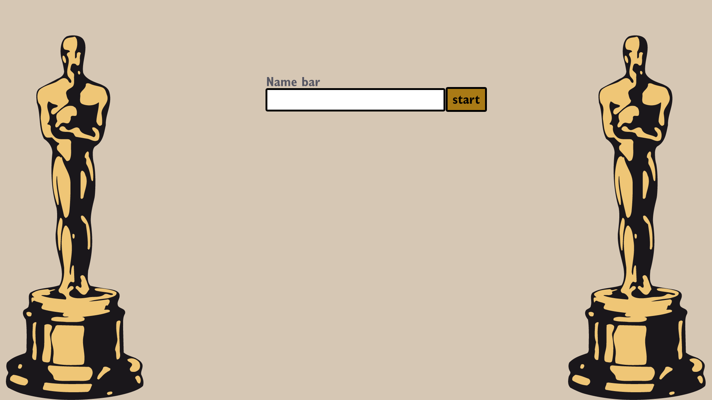
    The Gallery wireframe.

  

# Wireframes Mobile

# Features 

1. A Name bar where the username is required to move onto the next stage of the quiz.
   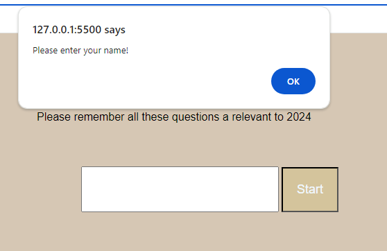
2. A right/wrong answer message depending on if the user got the answer correct or not.
   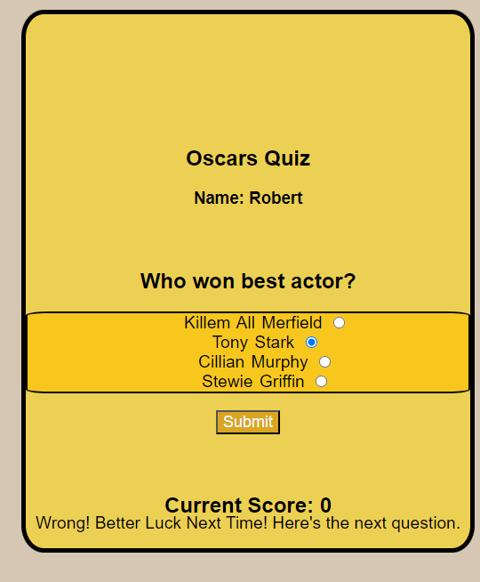
3. A try again button and score round up at the end of the quiz to show the total score for the user.
   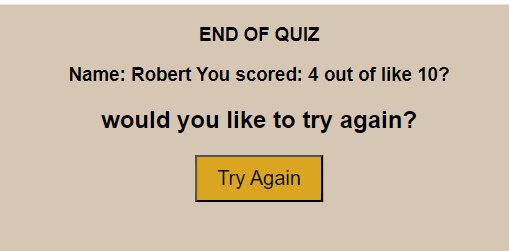
4. A feature using jquery to show the name on the users quiz card when they are playing the quiz. It also shows up at the end aswell.
   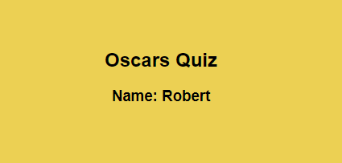

## Future features
 For the future features I would like to add a shop page to the website where the user can click on the image and buy the image from the website and for it to be printed onto a canvas.

# Technologies Used 
* Google Fonts
* Adobe PhotoShop
* HTML 
* CSS
* VSCode
* Code Anywhere 
* Blackbox AI
* Github.com
* Git
* Font Awesome
* Am I Reponsive
* Jquery
* Javascript

# Manual testing 

| Action       | Predicted Outcome        | Outcome       |
|:-------------|:--------------:|--------------:|
| Enter user name| To go onto next page & shows name on next page     | works      |
| Click submit      | to go onto next page       | works       |
| Click submit on quiz      | Evaluates score    | works       |
| Click submit on quiz | Moves to next question | works |
| Click try again on quiz | goes to quiz start | works | 
| User doesn't enter name | Alert shows | works |
| User gets question wrong | Score stays same | works |
| User gets question right | Score increases | works |

## W3C Validation 
Managed to fix these few errors by finding the lines of code referenced on the page and removing the stray tags and correctly formating the code. Here are the results. 
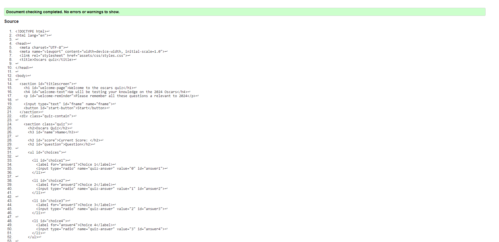

 

### JSHint
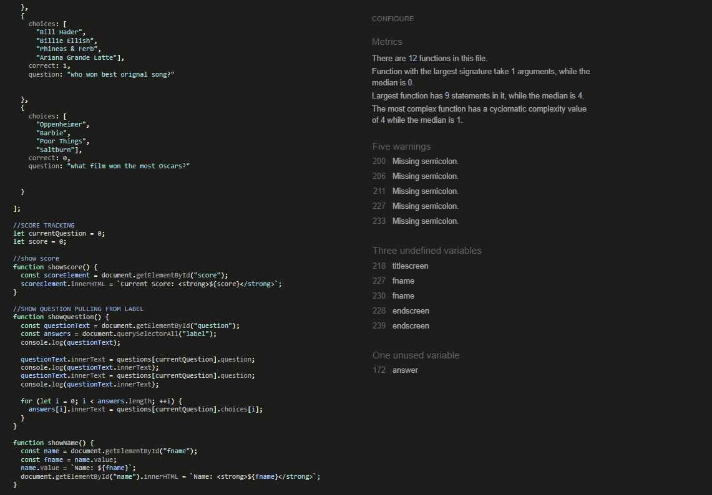

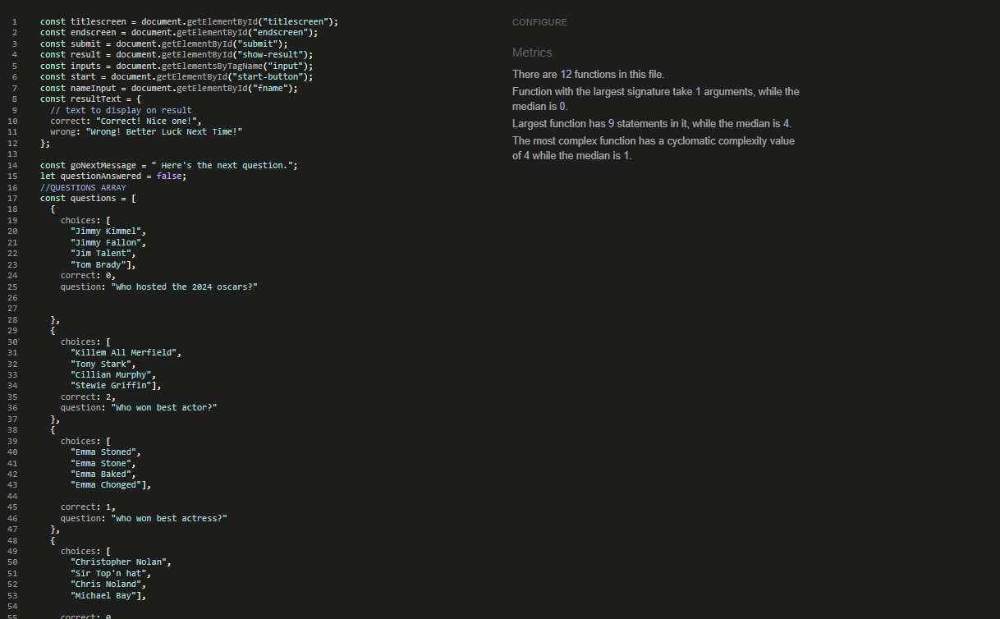

### Am I Responsive 
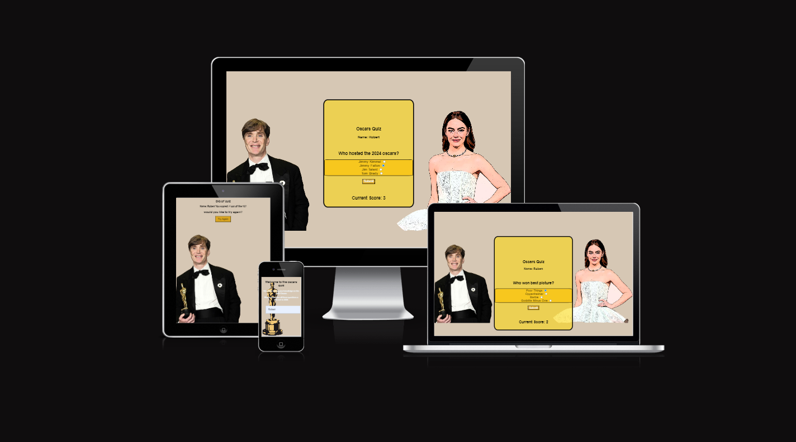

### Lighthouse Report 
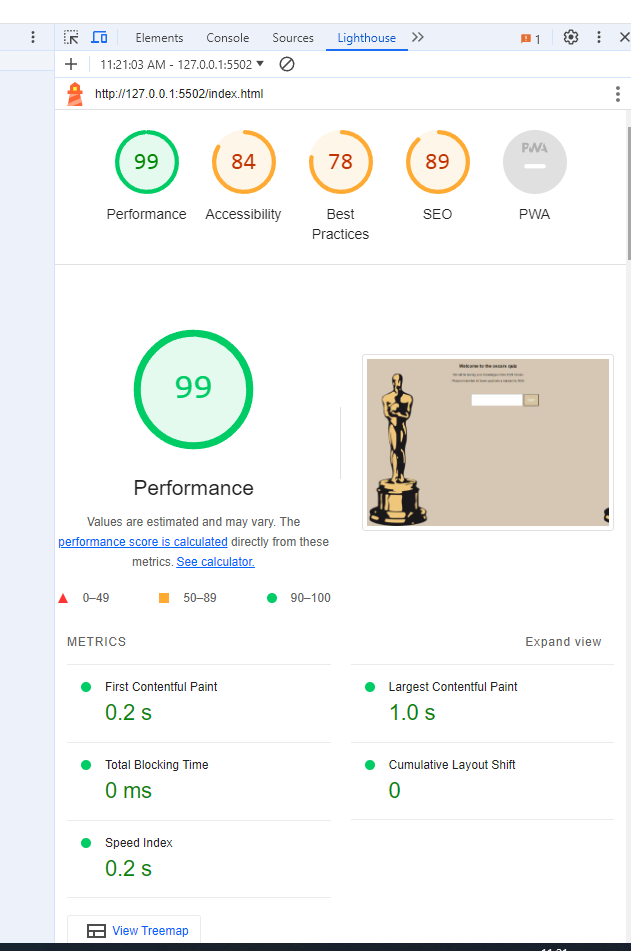
Lighthouse report looks good on this.

# Challenges and Bugs
The only bugs I got were unclosed elements and stray tags. Some titles weren't formatted correctly which you can see here.
At first the webpage was not valid as seen by this screenshot here 
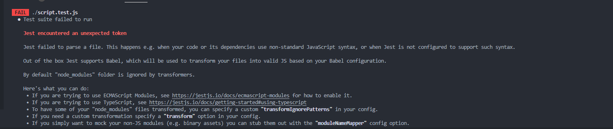
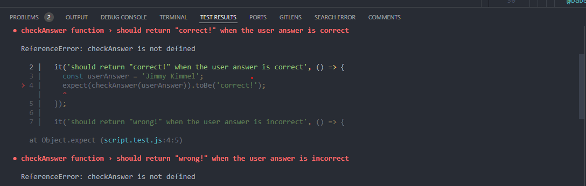

I also ran into a script error which I managed to solve with some research.

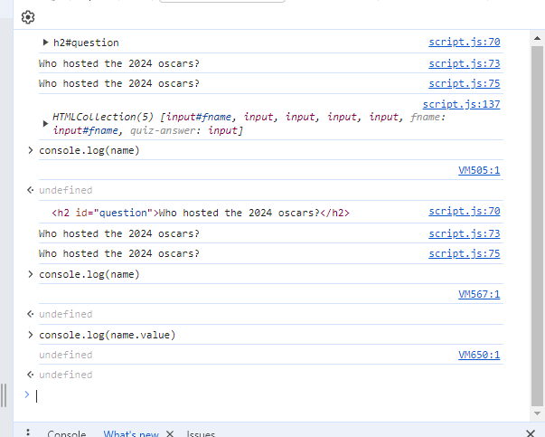

Here is also the invalid w3c html test 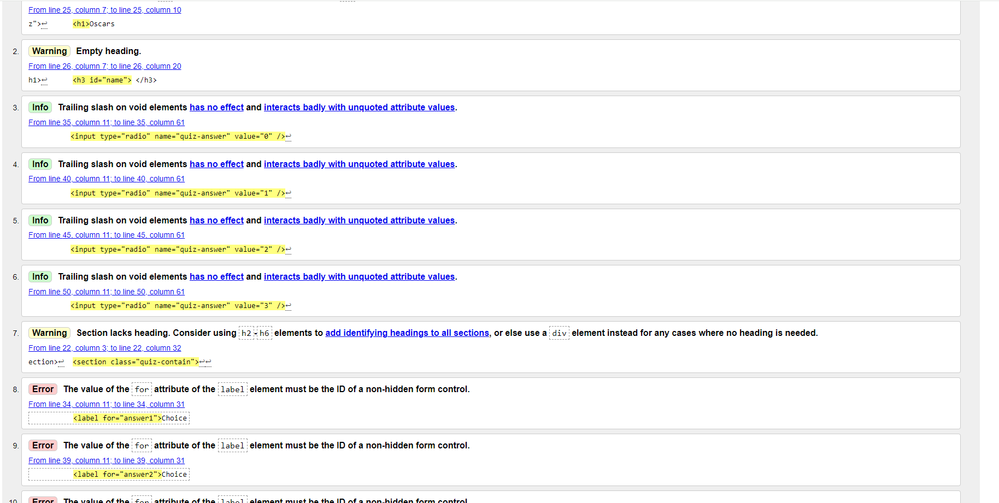

Ran into a bug during media queries on CSS trying to make the start button show on below 320px but I couldn't figure out where I was going wrong.

I ran into another problem again on my Github, I had made a previous account called "Twinwinter" on my email address robertwinterburn@hotmail.co.uk and I had made a new account to make my name a bit more professional and readable (RWinterburn) but when I started making commits they came from "Twinwinter" on one and "RWinterburn" from another I don't know wether it was to do with me from switching from gitpod.io and codeanywhere to VScode need to figure this problem out for future developments as I haven't figured it out yet. So you will see commits from both of my Github accounts.

# Deployment and Development 

### Deployment 

To deploy the website the user must 
* Log in to Github.com.
* Go to "settings".
* Click "pages" under "codes and automation".
* Select "deploy from a branch" and select the "main" branch.
* Then select "/(root)" 
* Click "save" to save the Github page source.
* Go to "code".
* Click on the yellow circle on the page repository.
* You will see the backend working on building the website when this is complete go to "settings"
* Click "pages" 
* You should see the website link https://rwinterburn.github.io/OscarsQuiz
* Click on the link and you will see the website.

### Development 
For future development go to https://github.com/RWinterburn/OscarsQuiz
* Click the green "code" button.
* Copy the URL
* Go to your cloud based coding site. e.g. Code Anywhere or Gitpod.io
* click on "new workspace". 
* Paste in the repository URL
* Click create and it will create the code space for you.

#### VSCode Development
For future development go to https://github.com/RWinterburn/OscarsQuiz
* Click the green "code" button.
* Copy the URL
* Open "command palette in VSCode (CTRL + SHIFT + P)
* Click the option "Git Clone"
* Click "clone from Github"
* Paste in the Repository URL 
* Hit "Enter"
* A window will pop up on your computer asking you to choose you repository destination, choose an appropriate folder. 
* Select the repository destination and the workspace will click open. 
* You may get the option saying "Do you trust this author? click Yes"

# Tutorials Used & external code implimented
Code has been partially used from these websites, most of the time when I first implimented it it wouldn't work as intended until I changed the parameters.
Black box Ai: https://www.blackbox.ai/
W3Schools:
https://www.w3schools.com/howto/howto_css_custom_checkbox.asp
Stackoverflow: 
https://stackoverflow.com/questions/10335231/javascript-equivalent-of-inputname-value-in-jquery

## Image Credits
* Oscars picture: https://in.pinterest.com/pin/academy-awards-png-academy-awards-artwork-award-clip-art-download--803048177290626601/

* Cillian Murphy original picture: https://www.bbc.co.uk/news/entertainment-arts-68531669

* Emma Stone orignal picture: https://people.com/oscars-2024-emma-stone-red-carpet-photos-8604131

